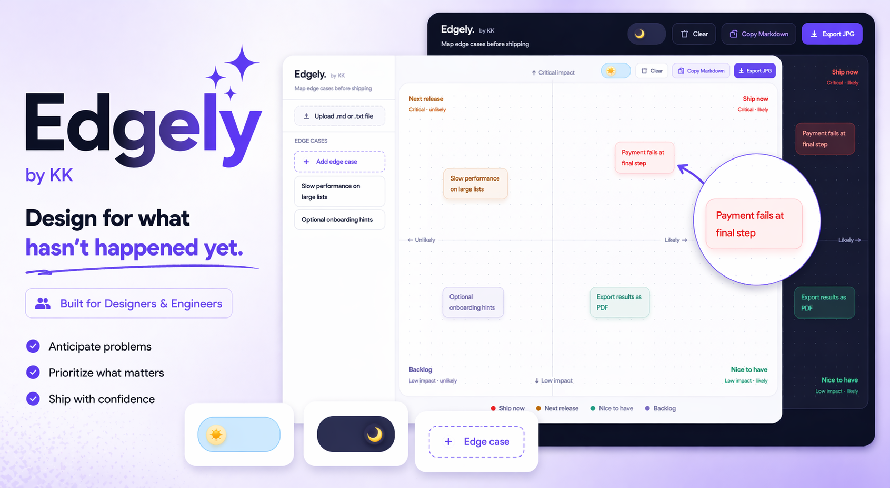

# Edgely by KK

[](https://edgely-teal.vercel.app)


**Map edge cases before shipping.**

Edgely is a tiny, focused tool for product designers and engineers to surface, prioritise, and document edge cases before handoff, not after. It turns the invisible work of thinking through failure states into a visual, collaborative artefact.

---

## What it does

Most design handoffs cover the happy path. Edgely helps you cover everything else.

You get a two-axis canvas,  **likelihood** vs **impact** — where you drag edge case cards into four priority quadrants:

| Quadrant | Meaning |
|---|---|
| **Ship now** | Critical impact, likely to happen — must be designed |
| **Next release** | Critical impact, unlikely — plan it soon |
| **Nice to have** | Low impact, likely — address if time allows |
| **Backlog** | Low impact, unlikely — documented, deferred |

---

## Features

- **Click anywhere on the map** to add an edge case card inline
- **Drag cards** across the canvas to reprioritise
- **Sidebar list** to collect and organise edge cases before placing them
- **Upload a `.md` or `.txt` file** — Edgely parses it and turns each item into a draggable card
- **Drag cards from map back to sidebar** by dragging them left
- **Copy Markdown** — exports a structured handoff doc grouped by priority
- **Export JPG** — captures the full map as an image for specs or presentations
- **Dark / light mode** with an animated toggle switch
- **Auto-saves** to `localStorage` — your work persists on refresh
- **Mobile responsive** — sidebar becomes a slide-in drawer on small screens
- **Animated empty state** — a heartbeat card guides first-time users
- **Splash screen** on load with a calm three-part intro sequence


---

## How to use

### Adding edge cases
- **Click anywhere on the map** — a card appears where you clicked, ready to type
- **Type in the sidebar** — click the `+ Add edge case` card at the top of the sidebar
- **Upload a file** — `.md` or `.txt` files are parsed automatically

### Prioritising
- **Drag** any card to a new position on the canvas
- The card colour updates instantly as you cross quadrant boundaries
- On **mobile**, tap the `→` arrow on a sidebar card to send it to the map

### Exporting
- **Copy Markdown** — structured text grouped by Ship now / Next release / Nice to have / Backlog
- **Export JPG** — a clean image of the full canvas, ready to embed in a Figma file, Notion doc, or Jira ticket

---

## Tech stack

- Pure HTML, CSS, JavaScript — no framework, no build step
- Single `index.html` file
- `localStorage` for persistence
- `html2canvas` for JPG export
- Deployed on Vercel

---

## Local development

No setup needed. Just open `index.html` in any modern browser.

```bash
git clone https://github.com/KhoshnazKazemian/edgely.git
cd edgely
open index.html
```

---

## Deployment

Deployed automatically via Vercel on every push to `main`.

Live at: **[edgely.vercel.app](https://edgely-teal.vercel.app)**

---

## About

**Edgely** is part of a series of small, focused product tools built by **KK** — each one designed to solve one real problem in product and design work, extremely well.

> *Design for what hasn't happened yet.*
